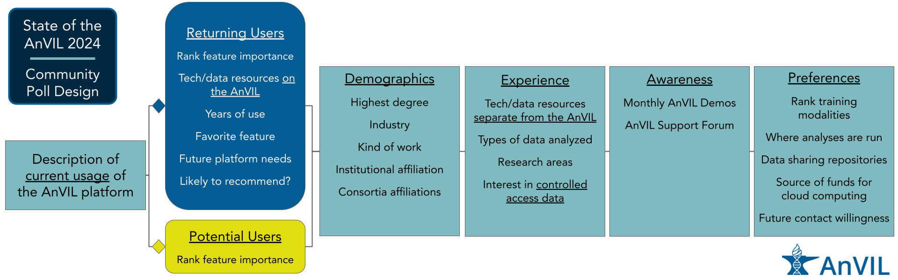

```{r, message = FALSE, echo = FALSE,results='hide', warning=FALSE}
library(here)
library(patchwork)
library(ggpubr)
library(tibble)
library(ggtext)

# Inherit plots
knitr::knit_child(here("analyses/3_MainAnalysis.Rmd"))
```

## Figure 1: Flowchart



## Figure 2: Type of User Identification and Background

```{r, fig.width = 12, fig.height = 16}

(typeOfUserPlot + xlim(c(0,45)) + ggtitle(""))  /
  (degreePlot + xlim(c(0,45)) + ggtitle("")) /
  (instTypePlot + xlim(c(0,45)) + ggtitle("")) +
  plot_layout(guides = 'collect',
              axis_title="collect") +
  plot_annotation(title = "Type of user identification and background",
                  tag_levels = 'A',
                  theme = theme(plot.title = element_text(size = 18),
                                plot.tag = element_text(face = "bold")))

#ggsave(here("plots/user_identification_panels.png"), width=12, height=16, units = "in")
```

## Figure 3: User research experience  

```{r, fig.width=9, fig.height = 11}
genomicsExpPlot_replot /
  vennExperience +
  plot_annotation(title = "User research experience",
                  tag_levels = 'A',
                  theme = theme(plot.title = element_text(size = 18),
                                plot.tag = element_text(face = "bold"))) +
  plot_layout(widths = c(9), heights = c(7, 6))

#ggsave(here("plots/user_research_experience_panels.png"), width=9, height=11, units = "in")

```

## Figure 4: Personas

```{r, fig.wdith = 7, fig.height = 7}
tidy_results_withPersona <- readRDS(here("data/wrangled_data/resultsTidy_personas.rds"))

kowpersona <- full_join(
  tidy_results_withPersona %>%
    select(persona, Timestamp) %>%
    mutate(Timestamp = factor(Timestamp),
           persona = na_if(persona, "None assigned")),
  dfForPlotKOW, by = "Timestamp") %>%
  group_by(UserType, persona, Timestamp) %>%
  mutate(Time_ID = cur_group_id()) %>%
  ungroup()

p1 <- ggplot(kowpersona,
       aes(x = Time_ID,
           y = factor(KindOfWork, levels = factorLevel),
           fill = KindOfWork
           )) +
  geom_tile() +
  theme_bw() +
  theme(axis.text.x=element_blank(),
        axis.ticks.x=element_blank(),
        legend.position = "None",
        text = element_text(size=12))+
  ylab("") +
  xlab("") +
  facet_wrap(~UserType, scales = "free_x") + 
  scale_x_continuous(expand = c(0, 0))

p2 <-ggplot(kowpersona,
       aes(x = Time_ID,
           y = -1,
           fill = persona)) +
  geom_col(width = 1) +
  theme_bw() +
  theme(axis.text.x = element_blank(),
        axis.ticks.x=element_blank(),
        axis.text.y = element_blank(),
        axis.ticks.y=element_blank(),
        strip.text = element_blank(),
        legend.position = "bottom") +
  ylab("") +
  xlab("Respondent") +
  facet_wrap(~UserType,scales = "free_x") +
  ylim(c(0,-1)) +
  scale_fill_grey(start = 0.8, end = 0, na.value = "white") +
  scale_x_continuous(expand = c(0, 0))

p3 <- kowpersona %>%
  select(persona, Time_ID) %>%
  distinct() %>%
  ggplot(aes(x = factor(1),
           fill=persona)) +
  geom_bar(stat="count", width=1) +
  coord_polar("y", start=0) +
  scale_fill_grey(start = 0.8, end = 0, na.value = "white") +
  theme_void() +
  geom_text(stat='count',
            aes(label = after_stat(..count..),
                color = persona),
            position = position_stack(vjust = 0.5)) +
  theme(legend.position = "none") +
  scale_color_manual(breaks = c("Educator", "PI", "Admin", "Analyst", "Clinician"), values = c(rep("white", 2), rep("black", 3)))

p1 / p2 / p3 +
  plot_layout(widths = c(7), heights = c(3.25, 0.25, 3.5)) +
  plot_annotation(title = "User personas",
                  theme = theme(plot.title = element_text(size = 18),
                                text = element_text(size=16)
                                ))

#ggsave(here("plots/personas_panels.png"), width=7, height=7, units="in")
```

## Figure 5: User Preferences

```{r, fig.width = 10, fig.height = 12}
(gdumbbell + ggtitle("")) /
  plot_spacer() /
  (tdumbbell + ggtitle("")) +
  plot_annotation(title = "User preferences",
                  tag_levels = "A",
                  theme = theme(plot.title = element_text(size = 18),
                                plot.tag = element_text(face = "bold"))) +
  plot_layout(guides = "collect",
              axis_title = "collect",
              widths = c(10), heights = c(6, 0.5, 4)) & theme(legend.position = 'bottom')

#ggsave(here("plots/user_preferences_panels.png"), width=10, height=12, units="in")
```

## Figure 6: Support Awareness

```{r, fig.width = 16, fig.height = 10}
((demoPlotRaw + ggtitle("") + xlab("")) + (demoPlot + ggtitle("") + ylab("") + xlab(""))) /
  ((forumPlotRaw + ggtitle("")) + (forumPlot + ggtitle("") + ylab(""))) +
  plot_annotation(title = "User awareness and utilization of AnVIL support",
                  tag_levels = "A",
                  theme = theme(plot.title = element_text(size = 18),
                                plot.tag = element_text(face = "bold"))) +
  plot_layout(guides = "collect") & theme(legend.position = "bottom")

#ggsave(here("plots/awareness_panels.png"), width=16, height=10, units="in")
```

## Figure 7: User Technological Comfort

```{r, fig.width = 10, fig.height = 12}
(PlotToolKnowledge_avg_score + ggtitle("") + ylab("")) /
  (whereRunPlot + ggtitle("") + ylab("")) +
  plot_annotation(title = "User technological comfort",
                  tag_levels = "A",
                  theme = theme(plot.title = element_text(size = 18),
                                plot.tag = element_text(face = "bold")))

#ggsave(here("plots/user_tech_comfort_panels.png"), width=10, height=12, units="in")
```
